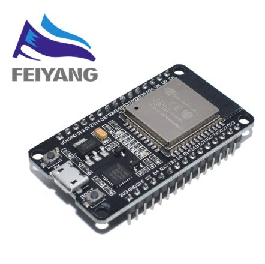

# Main boards
| ESP32 (240MHz) | ESP32 (160MHz) | | |
|------------|-------------|-------------|-------------|
|  |  |  |  |
| TTGO T-Camera ESP32 | | | |
|  | | |  |

## Cameras
| | | | |
|------------|-------------|-------------|-------------|
|  | | | |

## Displays
| | | | |
|------------|-------------|-------------|-------------|
|  |   |  | |

## Sensors
|  |  |  |  |
|------------|-------------|-------------|-------------|
|  |  |  |  |
|  |  |  |  |
|  |  |  |  |

## Devices
| Xiaomi MiJia | Xiaomi MiFlora | | |
|------------|-------------|-------------|-------------|
|  |  | | |
| Sonoff S20 | Doorbell Chime |  |  |
|  |  | | |

## DIY Boxes
| | | | |
|------------|-------------|-------------|-------------|
|  |  |  | |
| 70x45x30mm | 92x38x31mm | 85x58x33mm |  |

## Power supply/Converters
| | | | |
|------------|-------------|-------------|-------------|
|  |  | |  |

## Wires/Network/Flashing-components
| Dupont Wires | | | |
|------------|-------------|-------------|-------------|
|  |  |  |  |
| FT232RL | | | |
|  |  | | | |

## Connectors
| | | | |
|------------|-------------|-------------|-------------|
|  |  |  |  |

# In stock
- 5x [DIY Plastic Project Box](https://www.aliexpress.com/item/32878300213.html) - 70 X 45 X 30mm White
- 120pcs x 5 [Dupont wires](https://www.aliexpress.com/item/32800085018.html) -
- 2x [ESP8266 ESP-01S](https://www.aliexpress.com/item/32880024822.html) -
- 1x [FT232RL FT232 FTDI USB to TTL 3.3V 5.5V](https://www.aliexpress.com/item/32634246159.html) - 
- 8x [Xiaomi MiJia](https://www.aliexpress.com/item/32844220555.html) - 
- 2x [ESP32 WROOM-32, 160MHz](https://www.aliexpress.com/item/33020838035.html) - 
- 4x [EU Micro USB Charger](https://www.aliexpress.com/item/32837548671.html) - Output Interface: 5V/2.4A, Input: 100-240V/0.15A
- 2x [TTGO T-Camera ESP32 WROVER & PSRAM Camera Module ESP32-WROVER-B OV2640 Camera Module 0.96 OLED](https://www.aliexpress.com/item/4000029714373.html) -
- 2x [CHOETECH Travel USB Charger 12W](https://www.aliexpress.com/item/32742790687.html) - 
- 4x [Baseus 1m Micro USB Cable](https://www.aliexpress.com/item/32916331013.html) - 
- 6x [DIY Plastic Waterproof Clear Cover Box](https://www.aliexpress.com/item/32955651064.html) - 85 X 58 X 33mm White
- 6x [Sonoff S20](https://www.aliexpress.com/item/32854202946.html) - 
- 6x [Flexible Flat Cable Extension 24PIN](https://www.aliexpress.com/item/33020782574.html) - 
- 20x [Flexible Flat Cables 24PIN](https://www.aliexpress.com/item/32853717617.html) - 
- 4x [HC-SR04 Ultrasonic Wave Detector](https://www.aliexpress.com/item/32786781050.html) - 
- 6x [LILYGO® OV2640 2MP Camera Module Fish-eye Lens](https://www.aliexpress.com/item/32981773363.html) - 
- 6x [AM312 Mini-PIR](https://www.aliexpress.com/item/32749737125.html) - 
- 20x [LED indicator lights](https://www.aliexpress.com/item/32606955472.html) - 
- 4x [BH1750](https://www.aliexpress.com/item/32341898423.html) - 
- 2x [CCS811](https://www.aliexpress.com/item/32903358923.html) - 
- 4x [BME280](https://www.aliexpress.com/item/32849462236.html) - 
- 14x [2.4G Antenna for ESP32](https://www.aliexpress.com/item/32840852173.html) - 
- 10x [NodeMCU](http://s.click.aliexpress.com/e/pI2wgExm) - 
- 1x [5m 74px IP30, Black PCB](http://s.click.aliexpress.com/e/Kceu4gks) - 
- 3x [5m 30px IP30, Black PCB](http://s.click.aliexpress.com/e/Kceu4gks) - 
- 1x [2m 144px IP30](http://s.click.aliexpress.com/e/Kceu4gks) - 
- 2x [5m 60px IP67, White PCB](http://s.click.aliexpress.com/e/Kceu4gks) - 
- 2x [Wired Doorbell Chime 12V DC](https://www.aliexpress.com/item/32966895779.html) - 
- 2x [BME680](https://www.aliexpress.com/item/32961369966.html) - 
- 12x [ESP32S](https://www.aliexpress.com/item/32864722159.html) - 
- 26x [Aluminum Channel clear (50cm)](http://s.click.aliexpress.com/e/sHXT8lzI) - 13m total
- 2x [LM1117  6V-12V to 5V Step Down Power Converter](https://www.aliexpress.com/item/32659757988.html) - 
- 6x [0.96 inch oled IIC Serial Yellow-blue OLED Display Module 128X64](https://www.aliexpress.com/item/32896971385.html) - 
- 2x [0.96 inch oled IIC Serial White OLED Display Module 128X64](https://www.aliexpress.com/item/32896971385.html) - 
- 2x [0.96 inch oled IIC Serial Blue OLED Display Module 128X64](https://www.aliexpress.com/item/32896971385.html) - 
- 2x [DC5V WS2811 50 LEDs per string](https://m.aliexpress.com/item/33010869824.html) - 
- 1x [4 meter Red+4 meter Black Color Silicon Wire 8AWG](https://m.aliexpress.com/item/32808560744.html) - 
- 6x [Xiaomi Aqara mount](https://www.aliexpress.com/item/32863484842.html) - 
- 2x [5V 10A LED transformer Switch Power Supply EU plug](https://www.aliexpress.com/item/4000102102421.html) - 
- 4x [10 Meters 22AWG Red Black Wire](https://m.aliexpress.com/item/32821229368.html) -
- 2x [JCD Red-T1 Crimp Terminal 5PCS, max 10A](https://m.aliexpress.com/item/4000028655667.html)
- 2x [JCD Red-T2 Crimp Terminal 5PCS, max 10A](https://m.aliexpress.com/item/4000028655667.html)
- 2x [JCD Transparent-T1 Crimp Terminal 5PCS, 10A](https://m.aliexpress.com/item/4000028655667.html)
- 2x [JCD Transparent-T2 Crimp Terminal 5PCS, 10A](https://m.aliexpress.com/item/4000028655667.html)

# Tools
- [SN-28B+1550Pcs dupont crimping tool pliers terminal ferrule crimper wire hand tool set terminals clamp kit tool](https://www.aliexpress.com/item/33024193343.html) - 

# Ordered
- 6x [2mm Thickness Aluminium Electronic Project Case](https://www.aliexpress.com/item/32854971317.html) - 
- 2x [TTGO T-Camera ESP32 WROVER & PSRAM Camera Module ESP32-WROVER-B OV2640 Camera Module 0.96 OLED](https://www.aliexpress.com/item/4000029714373.html) -
- 2x [SRD-05VDC-SL-C](https://www.aliexpress.com/item/32857986495.html) - 
- 26x [Aluminum Channel milky (50cm)](http://s.click.aliexpress.com/e/sHXT8lzI) - 13m total
- 2x [5V 10A LED transformer Switch Power Supply EU plug](https://www.aliexpress.com/item/4000102102421.html) - 
- 10x [DC Male DC Female connector 2.1 * 5.5mm DC Power Jack Adapter Plug](https://www.aliexpress.com/item/32807618711.html) - 
- 1x [5 meter Red+5 meter Black Color Silicon Wire 10AWG](https://m.aliexpress.com/item/32982789709.html) - 
- 10x [NodeMCU](http://s.click.aliexpress.com/e/pI2wgExm) - 

## Ordered, but never received.
Tried 3 different vendors, none managed to deliver. Not sure why it's so difficult to get this, but seems to be sold out almost everywhere as well.

- 2x [Xiaomi MiFlora](https://www.aliexpress.com/item/33053566338.html) - 
