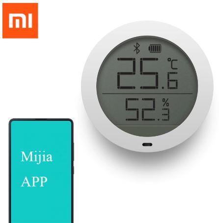

# Projects

## Smart doorbell

- ESP32 Board with:
  - Camera module
  - Buttons
  - PIR-sensor
  - Display (not needed but it was bundled with the board)
- Relay-board
- Doorbell Chime

### Config-files
TODO

## Bluetooth tracking hub
- ESP32 Board with:
  - Bluetooth
  - WiFi

### Track presence

### Tracking devices

### Tracking sensors

#### Plantsensor
| |
|----|
|  |

#### Temperature and Humidity
| |
|----|
|  |

## Remotely controlled powerplugs

- Sonoff s20

| |
|--|
|  |

### Config-files
TODO

## LED
- 10x [NodeMCU](http://s.click.aliexpress.com/e/pI2wgExm) - 
- 26x [Aluminum Channel (50cm)](http://s.click.aliexpress.com/e/sHXT8lzI) - 13m total
- 1x [5m 74px IP30, Black PCB](http://s.click.aliexpress.com/e/Kceu4gks) - 
- 3x [5m 30px IP30, Black PCB](http://s.click.aliexpress.com/e/Kceu4gks) - 
- Total of 20m LED-strips
