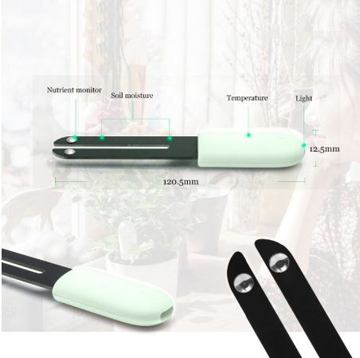

# Projects

## Smart doorbell

- ESP32 Board with:
  - Camera module
  - Buttons
  - PIR-sensor
  - Display (not needed but it was bundled with the board)
- Relay-board
- Doorbell Chime

| |
|----|
|  |
|  |

### Config-files

#### Ttgocam config
```
substitutions:
  devicename: ttgocam
  friendly_name: esp32cam
  ip_address: !secret ttgocam_static_ip_address

esphome:
  name: $devicename
  platform: ESP32
  board: esp-wrover-kit

wifi:
  ssid: !secret wifi_ssid
  password: !secret wifi_password
  manual_ip:
    static_ip: $ip_address
    gateway: !secret gateway_ip
    subnet: !secret subnet_ip


# Enable logging
logger:

# Enable Home Assistant API
api:

ota:

# Enable Web server.
web_server:
  port: 80

binary_sensor:
  - platform: gpio
    pin: GPIO33
    name: $friendly_name PIR
    device_class: motion

  - platform: gpio
    pin:
      number: GPIO34
      mode: INPUT_PULLUP
      inverted: True
    name: $friendly_name Button

  - platform: status
    name: $friendly_name Status

sensor:
  - platform: wifi_signal
    name: $friendly_name WiFi Signal
    update_interval: 10s
  - platform: uptime
    name: $friendly_name Uptime

esp32_camera:
  name: $friendly_name Camera
  external_clock:
    pin: GPIO32
    frequency: 20MHz
  i2c_pins:
    sda: GPIO13
    scl: GPIO12
  data_pins: [GPIO5, GPIO14, GPIO4, GPIO15, GPIO18, GPIO23, GPIO36, GPIO39]
  vsync_pin: GPIO27
  href_pin: GPIO25
  pixel_clock_pin: GPIO19
  power_down_pin: GPIO26
  resolution: 800x600
  jpeg_quality: 10
  vertical_flip: false
  horizontal_mirror: false

i2c:
  sda: GPIO21
  scl: GPIO22

font:
  - file: "fonts/times-new-roman.ttf"
    id: tnr1
    size: 20
  - file: "fonts/times-new-roman.ttf"
    id: tnr2
    size: 35

time:
  - platform: homeassistant
    id: homeassistant_time

display:
  - platform: ssd1306_i2c
    model: "SSD1306 128x64"
    address: 0x3C
    lambda: |-
      it.strftime(64, 0, id(tnr1), TextAlign::TOP_CENTER,"%d-%m-%Y", id(homeassistant_time).now());
      it.strftime(64, 64, id(tnr2), TextAlign::BASELINE_CENTER, "%H:%M", id(homeassistant_time).now());
```

#### Chime and doorbell-button
Todo

## Bluetooth tracking hub
- ESP32 Board with:
  - Bluetooth
  - WiFi

### Track presence

### Tracking devices

### Tracking sensors

#### Plantsensor
| |
|----|
|  |

#### Software

ESPHome

#### Config-files

Todo

#### Temperature and Humidity
| |
|----|
|  |

#### Software

ESPHome

#### Config-files

```
esphome:
  name: 'tempsensors'
  platform: ESP32
  board: esp32dev

wifi:
  ssid: !secret wifi_ssid
  password: !secret wifi_password
  manual_ip:
    # Set this to the IP of the ESP
    static_ip: !secret esp_temphub_static_ip
    # Set this to the IP address of the router. Often ends with .1
    gateway: !secret gateway_ip
    # The subnet of the network. 255.255.255.0 works for most home networks.
    subnet: !secret subnet_ip
    dns1: 8.8.8.8 # google-dns
    dns2: 8.8.4.4 # google-dns

api:

web_server:
  port: 80

logger:

ota:

# Enable Bluetooth scanning for this ESP32
esp32_ble_tracker:

sensor:
  - platform: xiaomi_lywsdcgq
    mac_address: !secret bedroom_xiaomi_mijia_mac_address
    temperature:
      name: "Bedroom Xiaomi MiJia Temperature"
    humidity:
      name: "Bedroom Xiaomi MiJia Humidity"
    battery_level:
      name: "Bedroom Xiaomi MiJia Battery Level"
  - platform: xiaomi_lywsdcgq
    mac_address: !secret bathroom_xiaomi_mijia_mac_address
    temperature:
      name: "Bathroom Xiaomi MiJia Temperature"
    humidity:
      name: "Bathroom Xiaomi MiJia Humidity"
    battery_level:
      name: "Bathroom Xiaomi MiJia Battery Level"
  - platform: xiaomi_lywsdcgq
    mac_address: !secret livingroom_xiaomi_mijia_mac_address
    temperature:
      name: "Livingroom Xiaomi MiJia Temperature"
    humidity:
      name: "Livingroom Xiaomi MiJia Humidity"
    battery_level:
      name: "Livingroom Xiaomi MiJia Battery Level"
  - platform: xiaomi_lywsdcgq
    mac_address: !secret kitchen_xiaomi_mijia_mac_address
    temperature:
      name: "Kitchen Xiaomi MiJia Temperature"
    humidity:
      name: "Kitchen Xiaomi MiJia Humidity"
    battery_level:
      name: "Kitchen Xiaomi MiJia Battery Level"
  - platform: uptime
    name: "TempHub Uptime Sensor"
  - platform: wifi_signal
    name: "TempHub WiFi Signal Sensor"
    update_interval: 60s
```

## Remotely controlled powerplugs

- Sonoff s20

| |
|--|
|  |

### Software
[Sonoff HomeAssistant integration](https://github.com/AlexxIT/SonoffLAN/)

### Config-files
#### In configuration.yaml
```
# Enable sonoff integration
sonoff:
  username: !secret sonoff_user
  password: !secret sonoff_pass
#  reload: always  # update device list every time HA starts
```
#### In ui-lovelace.yaml

```
resources:
# Name: auto-entities-card
# Description: Automatically displays entities based on filters, makes ot easy to show several entities with minimal config effort
# Used in config? Yes
# Maintainer: HACS
# source: https://github.com/thomasloven/lovelace-auto-entities/blob/master/README.md
  - url: /community_plugin/lovelace-auto-entities/auto-entities.js
    type: module

# Name: fold-entity-row
# Description: Enables collapsible/expandable cards.
# Used in config? Yes
# Maintainer: HACS
  - url: /community_plugin/lovelace-fold-entity-row/fold-entity-row.js
    type: module

title: Home
views:

  - icon: mdi:toggle-switch
    title: Switches
    id: switches
    cards:

      - type: custom:auto-entities
        filter:
          include:
            - domain: switch
              entity_id: "switch.sonoff_*"
        card:
          type: custom:fold-entity-row
          head:
            type: section
            label: All Sonoff switches
```


## LED PSU Calculation
- Estiame 50 LED per 1 amp
- Add 1-2 amps for the controller

## LED
Parts:
- 2x [NodeMCU](http://s.click.aliexpress.com/e/pI2wgExm) - 
- 4x [Aluminum Channel (50cm)](http://s.click.aliexpress.com/e/sHXT8lzI) - 13m total
- 2x [1m 60px IP67, White PCB, WS2812B, DC5V](http://s.click.aliexpress.com/e/Kceu4gks) - 

### Software

[WLED](https://github.com/Aircoookie/WLED)

### Kitchen cabinet lights
| |
|--|
|  |
|  |

## LCD info-screens
Parts:
- 2x [0.96 inch oled IIC Serial Yellow-blue OLED Display Module 128X64](https://www.aliexpress.com/item/32896971385.html) - 
- 1x [ESP32 WROOM-32, 240MHz](https://m.aliexpress.com/item/32864722159.html) - 

| |
|--|
|  |

### Description
- One screen to show the time and temperatures inside+outside.
- One screen to show delays and when the next train is scheduled for the subway. Useful when commuting to work.

#### Config-files

```

...SNIP..

# Enable logging.
logger:

# Enable Home Assistant API.
api:

# Enable over-the-air updates.
ota:

# Enable Web server.
web_server:
  port: 80

sensor:
  - platform: wifi_signal
    name: $friendly_name WiFi Signal
    update_interval: 60s
  - platform: uptime
    name: $friendly_name Uptime

  - platform: homeassistant
    id: outside_temperature
    entity_id: sensor.yr_dewpoint_temperature
    internal: true

  - platform: homeassistant
    id: inside_temperature
    entity_id: sensor.home_temperature_average
    internal: true

binary_sensor:
  - platform: status
    name: $friendly_name Status

i2c:
  sda: GPIO21
  scl: GPIO22

font:
  - file: 'fonts/slkscr.ttf'
    id: font1
    size: 16

  - file: 'fonts/BebasNeue-Regular.ttf'
    id: font2
    size: 48

  - file: 'fonts/Arial.ttf'
    id: font3
    size: 14

# Sync time with Home Assistant.
time:
  - platform: homeassistant
    id: esptime

display:
  - platform: ssd1306_i2c
    model: "SSD1306 128x64"
    address: 0x3C
    lambda: |-
      // Print "Home" in top center.
      it.printf(64, 0, id(font1), TextAlign::TOP_CENTER, "Roadhouse!");

      // Print time in HH:MM format
      it.strftime(0, 60, id(font2), TextAlign::BASELINE_LEFT, "%H:%M", id(esptime).now());

      // Print inside temperature (from homeassistant sensor)
      if (id(inside_temperature).has_state()) {
        it.printf(127, 23, id(font3), TextAlign::TOP_RIGHT , "%.1f°", id(inside_temperature).state);
      }

      // Print outside temperature (from homeassistant sensor)
      if (id(outside_temperature).has_state()) {
        it.printf(127, 60, id(font3), TextAlign::BASELINE_RIGHT , "%.1f°", id(outside_temperature).state);
      }
```
