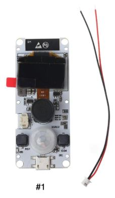
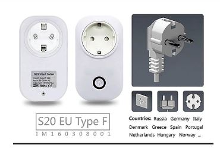
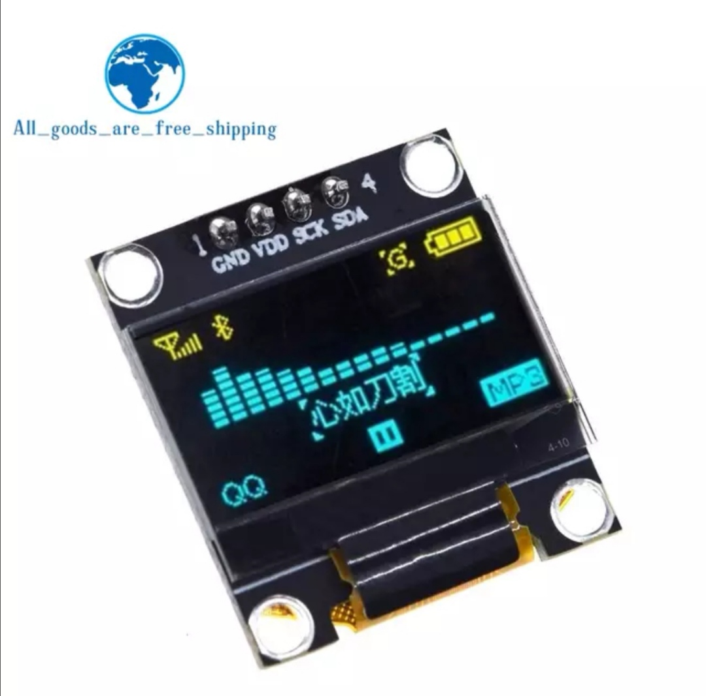

# Projects

## Smart doorbell

- ESP32 Board with:
  - Camera module
  - Buttons
  - PIR-sensor
  - Display (not needed but it was bundled with the board)
- Relay-board
- Doorbell Chime

| |
|----|
|  |
|  |

### Config-files
TODO

## Bluetooth tracking hub
- ESP32 Board with:
  - Bluetooth
  - WiFi

### Track presence

### Tracking devices

### Tracking sensors

#### Plantsensor
| |
|----|
|  |

#### Temperature and Humidity
| |
|----|
|  |

## Remotely controlled powerplugs

- Sonoff s20

| |
|--|
|  |

### Config-files
TODO

## PSU Calculation
- Estiame 50 LED per 1 amp
- Add 1-2 amps for the controller

## LED
Parts:
- 10x [NodeMCU](http://s.click.aliexpress.com/e/pI2wgExm) - 
- 26x [Aluminum Channel (50cm)](http://s.click.aliexpress.com/e/sHXT8lzI) - 13m total
- Total of 22m LED-strips
  - 1x [5m 74px IP30, Black PCB](http://s.click.aliexpress.com/e/Kceu4gks) - 
  - 3x [5m 30px IP30, Black PCB](http://s.click.aliexpress.com/e/Kceu4gks) - 
  - 1x [2m 144px IP30](http://s.click.aliexpress.com/e/Kceu4gks) - 

### Kitchen cabinet lights
| |
|--|
|  |
|  |

## LCD info-screens
Parts:
- 2x [0.96 inch oled IIC Serial Yellow-blue OLED Display Module 128X64](https://www.aliexpress.com/item/32896971385.html) - 
- 1x [ESP32 WROOM-32, 240MHz](https://m.aliexpress.com/item/32864722159.html) - 

| |
|--|
|  |

### Description
- One screen to show the time and temperatures inside+outside.
- One screen to show delays and when the next train is scheduled for the subway. Useful when commuting to work.
